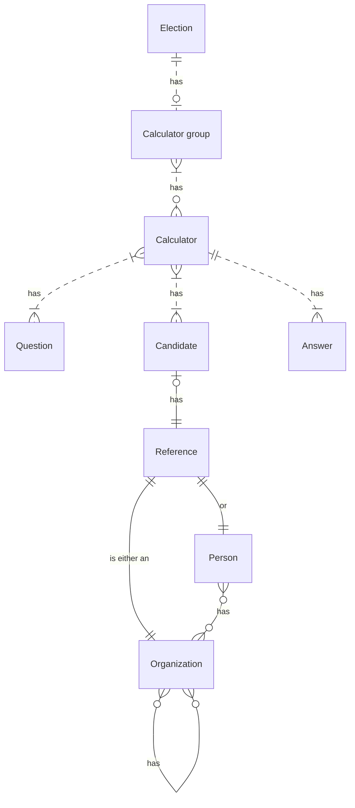

# Data

## Data architecture

Each instance of Volební kalkulačka uses a set of data for calculators.

The core principle of the data architecute is that each calculator is a set of complete, independent, current at the time data needed for running the calculator. The calculators, however, can be grouped and use unique identifers, so that the data can be connected all together.

### Architecture of a calculator

A calculator consists of:

- general information,
- a list of questions,
- a list of candidates,
- a list of candidates' answers,
- a list of persons
- and/or a list of organizations.

### Elections & grouping calculators

Although it is perfectly possible to create just one, independent calculator, it is common that there can be more related calculators at the time – for example for different election districts.

Therefore it is possible to group the individual calculators into a calculator group. Each calculator group can contain multiple variants of a calculator.

It is also possible to create an election, which in addition to variants, it also adds districts and rounds.

### IDs & keys

Each calculator can also be (except ID) identified via human-friendly key. How the key is composed depends on how the calculator, calculator group or election is structured:

- for standalone, independent calculator, the key is defined within the calculator `/{key}`, for example `/doprava-v-praze`
- for a calculator group, each calculator must have a variant defined resulting in key `/{group}/{variant}`, for example `/green-deal/pro-experty`
- for an election with neither districts nor rounds, `/{group}/{variant}`, for example `/prezidentske-2023/pro-mlade`
- for an election with districts only, `/{group}/{district}` or `/{group}/{variant}/{district}`, for example `/komunalni-2022/praha`
- for an election with rounds only, `/{group}/{round}` or `/{group}/{variant}/{round}`, for example `/prezidentske-2023/pro-mlade/2-kolo`
- for an election with both districts and rounds, `/{group}/{district}/{round}` or `/{group}/{variant}/{distdict}/{round}`, for example `/senatni-2022/pro-mlade/praha-11/2-kolo`

The keys have to be unique among the whole instance.

### Candidates, persons & organizations

Candidate is either a person or an organization, that responds to questions.

A person can be a member of one or multiple organizations, for example political parties or movements.

An organization can have either persons or organizations as members, therefore for example forming a coalition.

---

